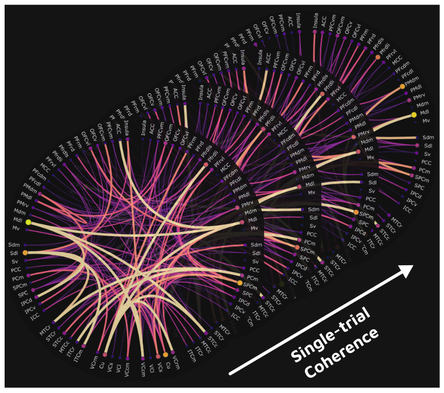

## Project info

**Title:**
Integration of the single-trial time-resolved spectral connectivity (coherence; PLV) in Frites

**Project lead and collaborators:** 
Lima, Vinicius; Combrisson, Etienne 

**Description:**
The synchronization of the activity from distinct brain areas has been proposed to be one of the mechanisms by which them integrate while processing similar inputs in order to exchange information or encode the stimulus (Buzsaki G.,2006; Fries P., 2015). Based on this hypothesis, 
the time-course of the functional connectivity (dFC) can be measured from brain signals using metrics that capture their phase-relation such as the cross-spectra, 
the phase-locking value (PLV), and the coherence (Bastos A.M., Schoffelen J.M. 2006). Additionally, apart from estimating those metrics in a time-resolved 
manner, in order to be able to relate the dynamics of the phase-coupling and task-related behavioral events, it is also relevant to assess the dFC
at single-trial level, hence, avoiding averaging out non-phase-locked bursts of synchronization that are present in the dFC and may correspond to brain states relevant to determining, for instance, whether the information is being encoded during cognitive tasks by the coordinated activity of multiple cortical areas.  
Currently, xfrites - the testing repository associated to Frites (https://brainets.github.io/frites/) - has a function that estimates dFC in terms of the aforementioned metrics. 
For the present project, we aim to integrate it with FRITES and, more specifically, we aim to improve the documentation of the function, 
refine the current implementation and include code for unit testing. Other goals are to implement notebooks with examples that allow the user to have a better understanding of how to first, set the parameters to estimate the spectral connectivity and seconds, to interpret the metric's outcome, what are
its advantages and drawbacks.

**keywords:** Communication through coherence; spectral analysis; wavelet coherence; dynamic functional connectivity.

**Goals for Brainhack Marseille**
- Describe the methods to other participants
- Refine the method implementation to estimate spectral connectivity present in xfrites
- Create the documentation for the method
- Write smoke and functional unit tests
- Create examples illustrating the purpose of the single-trial coherence / PLV

**Skills:**
- Spectral analysis 50%
- Python 80%

**Striking Image**

.
